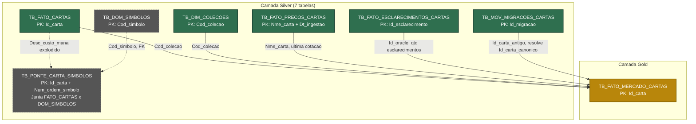

# Camada Gold

Uma única tabela: `TB_FATO_MERCADO_CARTAS` - visão de mercado de cartas de Magic: The Gathering pronta para consumo direto por analista, BI ou Genie, sem precisar conhecer Bronze/Silver.

- **Script:** `Dev/TB_FATO_MERCADO_CARTAS.py`
- **Utilitários:** `Dev/gold_utils.py` (config/extract/load/auditoria, mesmo padrão de `silver_utils.py`)
- **Comentários de negócio:** `Dev/gold_column_docs.py` (fonte única, aplicada via `COMMENT ON TABLE`/`ALTER COLUMN...COMMENT`)
- **Documentação:** [`Documentação/TB_FATO_MERCADO_CARTAS/Readme.md`](./Documentação/TB_FATO_MERCADO_CARTAS/Readme.md)

As 3 tabelas Gold anteriores (schema pré-DAMA, colunas em inglês que não existem mais na Silver) foram removidas - sem valor de negócio, sem consumidor real.

## Modelagem (Silver -> Gold)

`TB_FATO_MERCADO_CARTAS` usa 5 das 7 tabelas Silver. `TB_DOM_SIMBOLOS` e `TB_PONTE_CARTA_SIMBOLOS` existem na Silver (análise por símbolo/cor de mana) mas têm grão incompatível com a Gold (carta x símbolo, não carta x cotação) - não entram na junção.

Verde = alimenta a Gold. Cinza tracejado = existe na Silver mas não entra na junção (grão incompatível). `TB_PONTE_CARTA_SIMBOLOS` não tem seta pra Gold - por isso, não precisa de aresta "cruzada" pra dizer que não entra.
